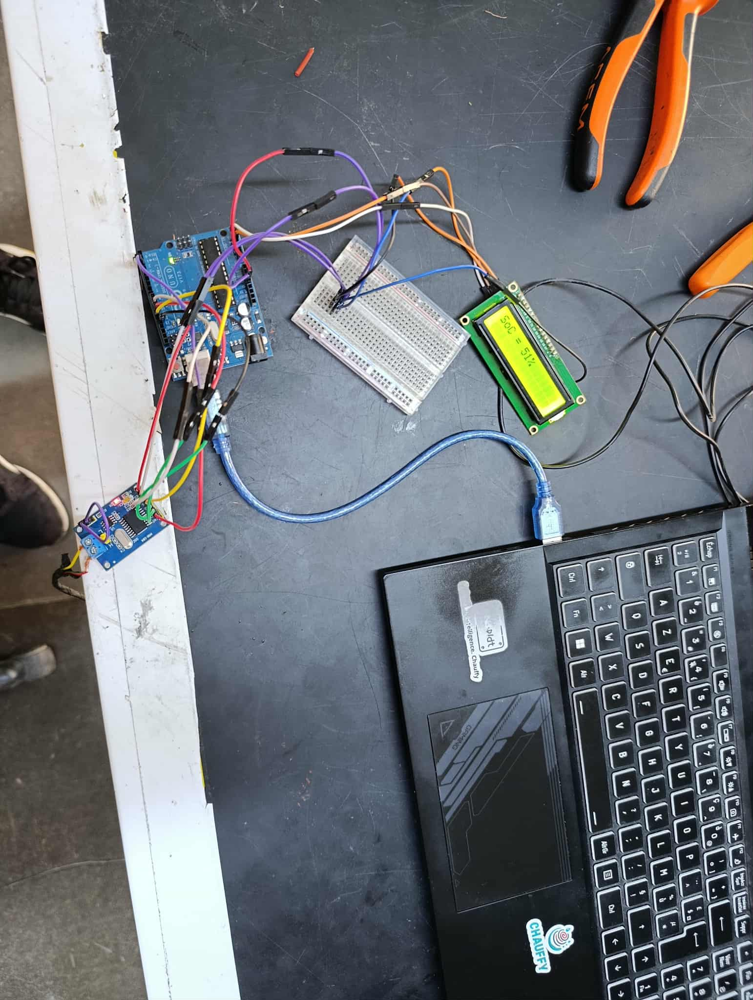
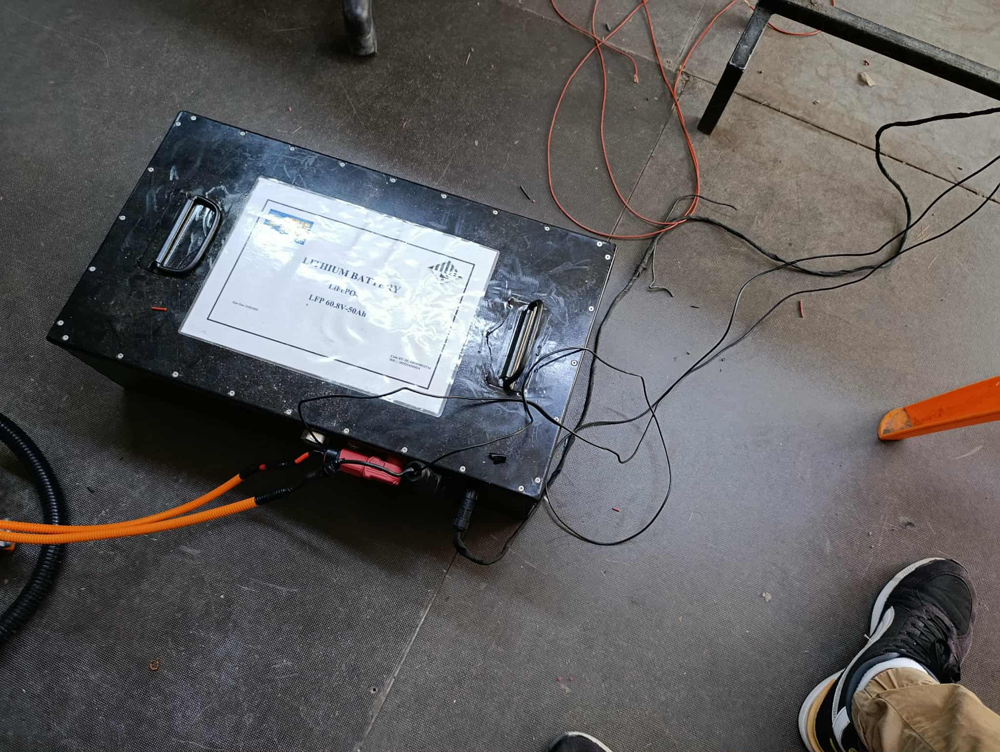

# 🔋 Bako Motors Battery SoC Monitor

## 📌 Contexte
Ce projet a été développé pour **Bako Motors** afin de surveiller en temps réel le **State of Charge (SoC)** d’une batterie.  
La communication se fait via le **bus CAN** (CAN High & CAN Low) en interrogeant le **BMS** (Battery Management System) avec des requêtes CAN spécifiques, puis en affichant le résultat sur un **écran LCD I2C**.

  
*Vue d'ensemble du montage : Arduino UNO connecté au module CAN, breadboard, écran LCD I2C affichant "SoC = 50%", et ordinateur portable pour le développement.*

  
*Batterie Lithium LiFePO4 60V 50Ah avec boîtier protégé, connectée via câbles orange pour l'alimentation.*

  
*Affichage détaillé sur l'écran LCD : "SoC = 51%", avec connexions visibles sur la breadboard.*

## ⚙️ Matériel utilisé
- 🟦 **Arduino UNO**  
- 📡 **Module MCP_CAN (MCP2515 + TJA1050)**  
- 🖥️ **Écran LCD I2C** (16x2 ou 20x4)  
- 🔋 Batterie avec **BMS compatible CAN** (Bako Motors)  

## 🛠️ Fonctionnalités principales
- Envoi de **requêtes CAN** vers l’ID correspondant du BMS.  
- Réception et décodage des **réponses CAN** contenant l’état de charge (SoC).  
- Affichage du niveau de batterie en **%** sur l’écran LCD.  

## 📂 Organisation du code
Le code source se trouve dans [`CAN_LCD.ino`](CAN_LCD.ino).  

## 🔧 Dépendances

Ce projet utilise les bibliothèques Arduino suivantes :  

- [`mcp_can`](https://github.com/coryjfowler/MCP_CAN_lib) : pour la communication CAN avec le MCP2515  
- `LiquidCrystal_I2C` : pour contrôler l’écran LCD via I2C  

### Installation
- Ouvrir l’IDE Arduino  
- Aller dans **Sketch → Include Library → Manage Libraries...**  
- Rechercher et installer :  
  - **MCP_CAN_lib** (par Cory J. Fowler)  
  - **LiquidCrystal_I2C**

## 🚀 Utilisation
1. Connecter le module MCP_CAN à l’Arduino UNO (SPI : pins 10, 11, 12, 13).  
2. Relier **CAN_H** et **CAN_L** du MCP2515 au bus CAN de la batterie.  
3. Brancher l’écran LCD I2C (SDA → A4, SCL → A5 sur Arduino UNO).  
4. Charger et téléverser le code `CAN_LCD.ino` dans l’Arduino.  
5. Mettre sous tension la batterie → le SoC s’affiche sur l’écran LCD.  

## 👨‍💻 Auteur
Projet réalisé par **[Ton nom]**, pour **Bako Motors**, 2025.  

## 📜 Licence
Ce projet est distribué sous la licence [MIT](LICENSE).
